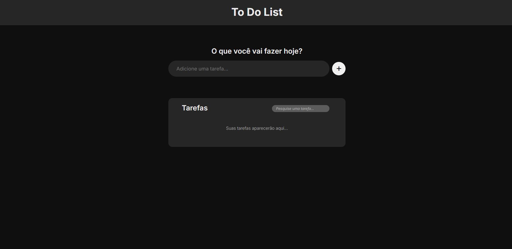

# 📝 To-Do List App

Aplicação simples e funcional de **lista de tarefas**, desenvolvida com tecnologias web fundamentais. O foco principal deste projeto foi a prática intensiva de manipulação do DOM e a criação de uma interface limpa e responsiva.

---

## ✨ Funcionalidades

- **Adicionar Tarefas:** Criação dinâmica de itens na lista.
- **Conclusão:** Feedback visual (texto riscado) para tarefas finalizadas.
- **Edição:** Permite alterar o conteúdo de uma tarefa já criada.
- **Remoção:** Exclusão individual de itens.
- **Busca em Tempo Real:** Filtro inteligente que atualiza a lista conforme você digita.
- **Responsividade:** Layout adaptável para qualquer tamanho de tela.

---

## 📸 Screenshots

*Exemplo da interface principal e sistema de busca.*

---

## 🛠 Tecnologias

- **HTML5:** Estrutura semântica dos elementos.
- **CSS3:** Estilização moderna, Flexbox e animações de feedback.
- **JavaScript (ES6):** Lógica de negócios e manipulação dinâmica do DOM.
- **Font Awesome:** Ícones vetoriais para ações (editar, excluir, concluir).

---

## 🚀 Como executar o projeto

Para visualizar o projeto localmente, siga estes passos:

1. Clone o repositório:
   `git clone https://github.com/vavito/To-Do-List.git`

2. Acesse a pasta do projeto:
   `cd toDoList`

3. Abra o arquivo no navegador:
   Basta abrir o arquivo `index.html` diretamente no seu navegador preferido.

*Nota: Não é necessário instalar dependências externas ou rodar servidores, o projeto é 100% Client-Side.*

---

## 🧠 Regras de Negócio e Comportamento

- **Validação:** Não é possível adicionar tarefas vazias ou apenas com espaços.
- **Estado de Edição:** Ao marcar uma tarefa como concluída, a opção de edição é desabilitada para manter a integridade do histórico.
- **Estado Vazio:** A mensagem informativa de "Lista Vazia" reaparece automaticamente quando todos os itens são removidos.

---

## 📈 Possíveis Melhorias Futuras

- [ ] **LocalStorage:** Persistência de dados para não perder as tarefas ao atualizar a página.
- [ ] **Filtros de Status:** Visualizar apenas tarefas "Pendentes" ou "Concluídas".
- [ ] **Dark Mode:** Implementação de tema escuro para conforto visual.
- [ ] **Confirmação de Exclusão:** Modal para evitar remoções acidentais.

---

## 👤 Autor

Desenvolvido por **João Victor**.
- [LinkedIn](https://www.linkedin.com/in/joao-victor-moreira-almeida/)
- [GitHub](https://github.com/vavito)